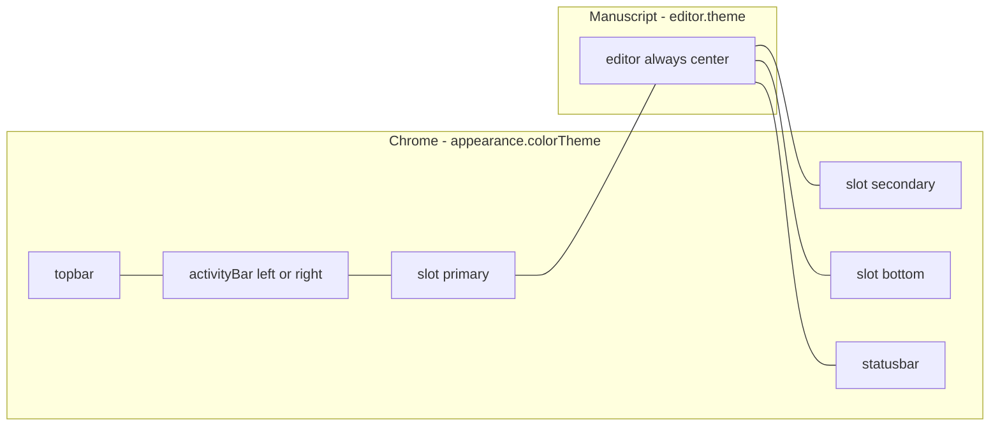
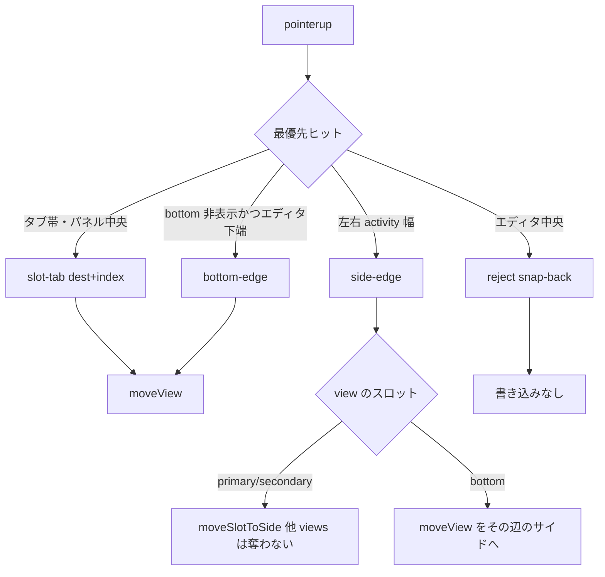
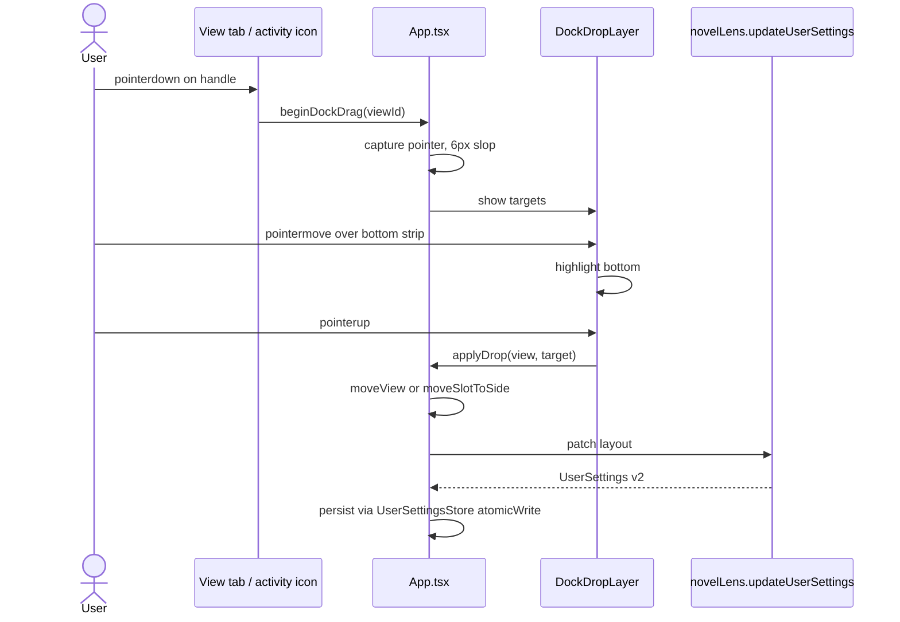
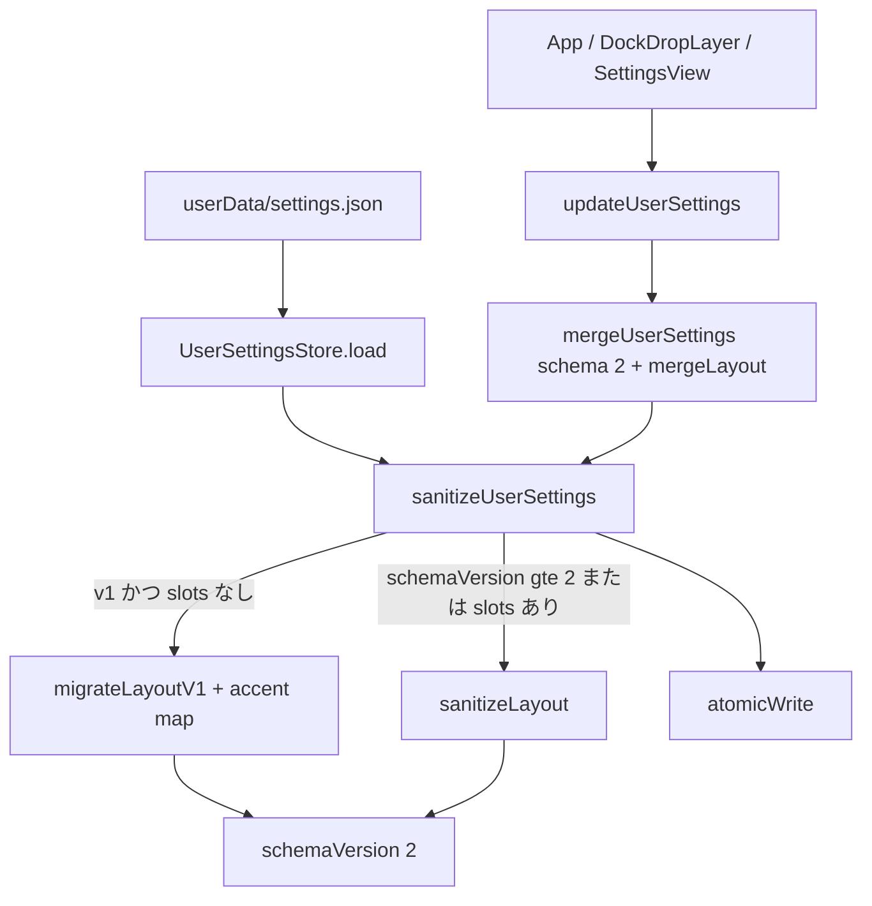

# Novel Lens ワークベンチ視覚システムと VS Code 型レイアウト

| 項目 | 内容 |
|---|---|
| 文書 | Novel Lens workbench visual system + dockable layout |
| 対象アプリ | `apps/novel-editor`（UI 名 **Novel Lens**、v0.2.1） |
| 作成日 | 2026-09-02 |
| 改訂 | 2026-09-02（レビュー 330cf1fe: sanitize/merge、ドロップ写像、移行、PR 順） |
| 作成者 | Design / architecture（実装前ドラフト） |
| 状態 | 実装済み |
| 言語 | 日本語第一。識別子・型・クラス名はコードどおり英語 |

---

## Overview

Novel Lens の作業 UI は、**原稿を中心にした日本語執筆ワークベンチ**である。現状は二世代の CSS が積層し、アイコンの森緑＋金レンズではなく紫の SaaS グローが既定アクセントになっている。設定オーバーレイは元々 `#181a1b` 固定、Welcome はクリーム固定、ワークベンチはクールグレー／ネイビーという **混色クロム** が残っている。レイアウトは VS Code 型のグリッドだが、位置変更は `SettingsView` の `<select>` のみで、ドラッグでパネルを移せない。

本設計は次の二つを同時に解く。

1. **アイコンを正とした単一トークン契約**（`--nl-*`）。ライトは紙白、ダークは森チャコール。アクセントは森緑と金だけ。原稿紙面トークンは `.editor-pane` に隔離する。
2. **執筆サイズのドッキングモデル**。`outline` / `lens` / `search` / `history` をスロット（左・右・下）へドラッグ移動でき、同一スロット内はタブとして共有する。永続化は既存の `UserSettingsStore`（`settings.json`）を schemaVersion 2 へ拡張する。`window.novelLens` に新チャネルは足さない。

ポートフォリオ https://hum1.dev の **編集的な階層・二言語アイブロウ・余白・一色アクセント** をワークベンチへ適用する。ヒーローグリッドや mite.you の虹タイルは持ち込まない。

---

## Background & Motivation

### 製品原則（崩さない）

`docs/product-proposal.md` の固定原則（文言は提案書に合わせる）:

- 本文が主役。クロムは書くための枠であり、ダッシュボードではない。
- **AI は任意。** 売り文句を「AI搭載」にしない。検索・履歴・縦書き・設定はアカウントなしで使える。本設計はレンズ機能を変えない。
- 原稿は作者のもの。ローカル所有。テレメトリなし。クラウド同期なし。
- 日本語を後付けにしない。IME、`vertical-rl`、禁則を基盤から守る。

`docs/desktop-implementation-status.md` は VS Code 型の独立設定画面と atomic なユーザー設定を実装済みとする。本設計はそれを **見た目と配置操作** で完成させる。機能追加（レンズ、AI、履歴）は対象外。

### 現状: 二世代の視覚が喧嘩している

`apps/novel-editor/src/renderer/styles.css` は先頭から二層ある。

**第1層（L1–247）: 原系統・温かい紙**

```css
:root { --accent: #315d51; background: #eee9df; }
.app { --surface: #f7f4ed; --editor-paper: #fffdfa; }
.app.theme-sepia { ... }
.app.theme-dark { --surface: #1f2423; --accent: #8bb7a8; }
.settings-view { color: #d8d8d8; background: #181a1b; }
.welcome { color: #2d2923; background: linear-gradient(135deg, #f4efe5, #e9e1d4); }
```

**第2層（L248–610、コメント `2026 visual system`）: クール SaaS**

```css
.app-shell.ui-light { --ui-bg: #f4f5f9; --ui-text: #202231; }
.app-shell.ui-dark { --ui-bg: #0c0e14; --ui-editor: #11141c; }
.app-shell.accent-violet { --ui-accent: #8b5cf6; }
.app-shell.accent-blue { --ui-accent: #3b82f6; }
.app-shell.accent-amber { --ui-accent: #f59e0b; }
```

`App.tsx` はシェルをこう組む。

```158:158:apps/novel-editor/src/renderer/App.tsx
  const shellClass = `app-shell ui-${colorTheme} accent-${userSettings.appearance.accent} density-${userSettings.appearance.density}`;
```

既定は `AppearancePreferences.accent: "violet"`（`settings.ts` L108）。アイコンの森緑は使われない。さらに:

- `.app.theme-sepia` / `.app.theme-dark` は **どこからも class が付かない**。原稿色は `.editor-pane.manuscript-paper|sepia|dark` だけ。第1層のテーマクラスは死コード。
- `.editor-pane.manuscript-paper` は `.ui-dark` 内でも `#fffefa` を強制する。クロムと原稿の混色が既定で起きる。
- `.settings-view` は L158 でダーク固定したあと L532 で `--ui-*` 継承にパッチ。カスケード依存。
- Welcome の `.home-action-icon.blue` / `.amber`、`.tile-files` 等は `#a78bfa` `#f472b6` `#22d3ee` の虹。`AppIcon` のストローク言語と矛盾。
- `.app-shell` は `font-family: Inter, "Yu Gothic UI", ...` だが `index.html` は Inter を読まない。CSP は `style-src 'self' 'unsafe-inline'` で Google Fonts も拒否。実体は Yu Gothic UI。宣言だけが英語 UI を装っている。
- `BrowserWindow` の `backgroundColor: "#f3efe7"`（`main/index.ts` L368）は第1層の紙。ダーク起動時に白いフラッシュが残る。

**カスケードそのものが UX バグである。** トークンを足すのではなく、第1層の死ルールと第2層のクールグレー／紫を削除し、アイコン由来の契約だけを残す。

### 現状: VS Code 型に見えるが動かせない

`LayoutPreferences`（`settings.ts` L64–74）:

```ts
primarySidebar: "left" | "right"
inspector: "left" | "right" | "bottom"
activityBar: "left" | "right"
showPrimarySidebar, showInspector
sidebarWidth, inspectorWidth, bottomPanelHeight
zenMode
```

`App.tsx` L581–602 は CSS Grid を `activity | outline | editor | inspector` で組み立て、`beginPaneResize` で幅だけ変える。`SettingsView.tsx` L203–212 は `<select>` と range。ドロップゾーンも、ビュー単位の移動も、アクティビティアイコンのドラッグもない。レンズ／検索／履歴は `InspectorTab` として **一つの inspector に固定**。

ユーザー要求は「設定のドロップダウンではなく、VS Code のように自分で位置を動かす」こと。ドロップダウンはアクセシビリティのフォールバックとして残し、主操作はドラッグにする。

### ブランドの正: `build/icon.svg`

| 要素 | Hex | 役割 |
|---|---|---|
| 角丸正方形グラデ | `#3f7164` → `#203f38` | マーク背景。rx=228/1024 ≈ 22% |
| 左ページ | `#fffaf0` | 開いた本 |
| 右ページ | `#f1e5cf` | 開いた本 |
| 背 | `#d5c4a7` | 線 |
| 行ストローク | `#8c8172` | 本文の気配 |
| レンズリング／柄 | `#d49a48` | 金。二次アクセント |
| レンズ中心 | `#315d51` | 森緑。主アクセント |
| ドロップシャドウ | `#10231f` @ 28% | ダーククロムの種 |

`AppIcon.tsx` の `tile` ロゴは同じ色を既に持っている。ストロークアイコン（`files` `lens` `search` `history` …）は `currentColor`。Welcome の虹タイルだけが別言語。

### 味の参照: Hum1Tab/hum1.dev（検証済み）

`https://github.com/Hum1Tab/hum1.dev` は private リポジトリ。未認証ブラウザでは 404 になるが、認証済み GitHub CLI で `main` ブランチの実ソースを確認した。一次資料は `app/globals.css`、`app/page.tsx`、`app/layout.tsx`、`public/grainy-noise.webp`。公開結果は https://hum1.dev 。基調色は ink `#171817`、paper `#eee8db`、cream `#f7f1e7`、muted gold `#d3aa67`、補助色 mint `#73b8aa`。番号付きセクション、日英のアイブロウ、大きな明朝見出し、高いコントラスト、広い余白、非対称の大きな角丸、弱い環境光を使う。Novel Lens ではこの編集的な原則を、元アイコンの森緑＋金へ翻訳する。

Novel Lens への翻訳:

| hum1.dev / Pomotaro | 執筆ワークベンチ |
|---|---|
| 番号 `01` `02` | 既存 `.chapter-order` の `padStart(2, "0")` を強調。Welcome の操作も番号行 |
| 二言語アイブロウ | 既存 `.eyebrow`（`MANUSCRIPT` `WRITING` `PREFERENCES`）を金／ミュートで統一 |
| 大きな階層 | 原稿タイトルは明朝。クロムはゴシック |
| 一色アクセント | 森緑。金はレンズ・保存点・フォーカスリング |
| ダークガラス | Welcome の弱いグローだけ。本文・サイドバーに `backdrop-filter` は置かない |
| 余白 | 原稿キャンバスが常に最大領域 |

mite.you のカラフルなタイル、ポートフォリオのヒーローグリッド、お問い合わせフォームは **輸入しない**。

---

## Goals & Non-Goals

### Goals（テスト可能な成功条件）

**G1 テーマ統一。** Welcome、トップバー、アクティビティバー、アウトライン、インスペクター、ステータスバー、**エディタツールバー**、設定オーバーレイ、ダイアログ、バナーは、同一の light または dark クロムトークンだけを使う。原稿キャンバス（`.editor-scroll` / `.manuscript-editor`）だけが `--ms-*` を読む。`styles.css` の `#` は付録の許可ブロック以外 0（検証スコープは `styles.css`。`AppIcon.tsx` と `build/icon.svg` のブランド hex は対象外）。`rgb()` / `color-mix()` はトークンブロック内、または `var(--nl-*)` / `var(--ms-*)` を引数に取る場合だけ。ライト時に設定が `#181a1b` にならない。ダーク時に Welcome / ダイアログがクリームにならない。

**G2 アイコン整合パレット。** 既定アクセントは森 `#315d51`（ダーククロムでは `#8bb7a8`）。二次は金 `#d49a48`。ライト背景はクリーム族（`#f4efe5` 系）。ダーク背景は森チャコール（`#15201c` 系）。本文とフォーカスは WCAG AA（本文 4.5:1、UI 3:1）。金は本文色に使わない。

**G3 hum1.dev 原則の適用。** 二言語アイブロウ、番号付き章行、抑制されたタイプ、虹 SaaS タイルなし、アクセントは森＋金のみ。Welcome の `.tile-files` 等の紫／ピンク／シアン勾配を削除。検証: それらの hex が CSS に存在しない。

**G4 VS Code 型ドッキング。** ユーザーは `outline` / `lens` / `search` / `history` を左／右／下へ **ビュー単位** で置ける。同一スロットはタブ共有。位置と `activeView` は再起動後も残る。受け入れはドラッグに加え、**設定のビュー単位セレクト**と **キーボード起動の移動メニュー**（`Shift+F10` / `contextmenu` キー）と **`layout.reset`**。ポインタなしで G4 を再現できない実装は不合格。Zen を出すと全ドックが隠れ、解除で所属は戻る。

**G5 使いやすさ。** 執筆キャンバスは常に最大領域。任意スロットの表示切替は 3 クリック以内（アクティビティ 1、設定チェック 1、Zen 1）。タブに × は置かない。Zen は維持。`writing-mode: vertical-rl` は `.manuscript-editor` だけ。スロット左右は物理座標。検証: 980×680 で縦書き＋下部が 440px 溢れを起こさない。エディタ列が 0 幅にならない。

**G6 CSS 負債。** 視覚システムは一つ。第1層の死ルール（`.app.theme-*`、Welcome 旧カード、設定の `#181a1b` ブロック）と第2層のクールグレー／紫を削除する。検証（PR2 ゲート、対象 `styles.css`）: `.theme-sepia`、`accent-violet`、`--ui-`、`#8b5cf6`、`#a78bfa`、`#0c0e14`、`#f4f5f9` が 0。Welcome のクラス名 `.home-action-icon.blue` 等も TSX から消す。`AppIcon.tsx` のタイル hex は残す。

### Non-Goals

- VS Code 完全クローン（スプリットエディタ、Editor Group グリッド、View Container マーケット、Webview、パネルの左右配置）。
- Tailwind / shadcn / Radix への書き換え。Pomotaro は Tailwind だが、本アプリは CSS + React を進化させる。理由: CSP、縦書き、明朝本文、追加バンドル、既存 610 行の CSS を捨てるコストがリターンを上回る。
- react-mosaic / flexlayout / allotment 等の汎用ドックライブラリ（代替 D で却下）。
- AI・レンズ・検索・履歴の**機能**変更。情報階層の並べ替えのみ。
- クラウドのレイアウト同期、テレメトリ、アカウントに紐づくテーマ。
- mite.you 型のウィジェットダッシュボード。
- Inter の新規ロード（CSP と日本語第一に反する）。

---

## Key Decisions

1. **クロムと原稿は分離する。切替は互いに触れない。** `appearance.colorTheme` が作業 UI（Welcome・トップバー・アクティビティ・サイドバー・**エディタツールバー**・ステータスバー・設定・ダイアログ・バナー）を決める。`editor.theme` は `.editor-scroll` / `.manuscript-editor` だけ。クロムを dark にしても原稿の `paper` は `paper` のまま。原稿を `dark` にしてもクロムは変わらない。ダーク枠＋紙キャンバスは許可。紙がトップバーまでクリームになることは禁止。作業 UI の「白なら白」はクロムの話であり、原稿キャンバスは作業 UI ではない。
2. **既定外観は新規ファイルだけライト紙。** `defaultUserSettings().appearance.colorTheme` を `"light"` にする。既存 `settings.json` の `"system"` は移行しない（sanitize は保存値を保持）。OS ダーク＋紙キャンバスは既存ユーザーに残り得る。それはキャンバス選択であり混色クロムではない。
3. **アクセントは `forest | gold | ink`。** 移行: `violet`→`forest`、`amber`→`gold`、`blue`→`ink`。既定 `forest`。旧バイナリへダウングレードすると `forest` は未知のため v0.2.1 sanitize が **violet に戻す**。互換ウィンドウ中も v2 ファイルへ `violet` は書かない（アイコン作業を自己否定するため）。
4. **トークンは `--nl-*` / `--ms-*`。PR1 はエイリアス可、PR2 で `--ui-*` ゼロ。** PR1 で `--nl-*` を定義し `--ui-*` と `--manuscript-*` をエイリアスする。G1/G6 の hex 掃除と `--ui-*` 削除は PR2。原稿トークン名は最終的に `--ms-*`（現行 `--manuscript-bg|ink|line` を置換）。
5. **ビューは独立ドック。既定配置は今日と同一。** schema を入れる PR から `slots.views` はビュー単位。インスペクター一塊のままにする実装は出さない。
6. **ドック幾何は画面の物理 left/right。** `vertical-rl` は `.manuscript-editor` のみ。
7. **永続化は既存 `settings.json`。IPC 追加なし。** `schemaVersion: 2`。`mergeUserSettings` は **必ず 2 を渡す**。v2（または `layout.slots` あり）は `sanitizeLayout` のみ。v1 だけ `migrateLayoutV1`。スロットは `mergeLayout` でディープマージする。現行 `settings.ts` L222–226 の `schemaVersion: 1` と浅い `{ ...layout }` はデータロスになるため廃止。v1 キーのミラーは `serializeUserSettings` が `projectLayoutV1` を `layout` に混ぜて書く。`UserSettingsStore` の `atomicWrite` はこれを呼ぶ（「store 変更なし」は嘘になるので捨てる）。
8. **ガラスは Welcome の弱いグローに限定。**
9. **ライブラリを増やさない。** `beginPointerSession` を resize と dock で共有し、`pointerup` / `pointercancel` / `lostpointercapture` で解除する。
10. **ドロップは 4 種。設定・コンテキストの「左／右／下」は `placeViewOnSide`（タブ合流）。** `slot-tab` / `bottom-edge` / `reject` はドラッグ。`side-edge` だけがスロット全体を辺へ移し、同一辺二列を作る。設定の 3 値セレクトは同一辺二列を作らない。コンテキストは項目を分ける（「このビューを…」＝ `placeViewOnSide`、「このパネルを左／右へ」＝ `moveSlotToSide`）。「必要なら `moveSlotToSide`」は禁止。
11. **隠す単位はスロット。`hiddenViews` は持たない。** 4 ビューは常にどれかの `views` に属する。タブに「このビューを外す」は置かない。欠落は sanitize が secondary へ戻す。
12. **エディタツールバーはクロム。** `.editor-toolbar` と `.statusbar` は `--nl-*`。`--ms-*` はスクロール面と textarea のみ。ダーククロム＋紙キャンバスでもツールバーはダークのまま。
13. **永続する下部パネル下限は現行どおり 200px。** `LAYOUT_LIMITS.bottom.min = 200`（sanitize / Settings range / リサイズの書き込み）。表示中の live 縮小は 200 を下回ってよい（エディタ 240px を守るため）。live 値は永続しない。
14. **アクティビティアイコン順は固定。** `outline, lens, search, history` の上段、設定類はフッタ。並び替え UI は無い。
15. **`history.variation` コマンドは対象外。** 別案は History パネルの既存ボタン（`App.tsx` L829）と、トップバーから外したあともそこへ辿れることで足りる。メニュー追加は本設計に含めない。
16. **`layout.reset` / `view.outline` / `view.zen` は必須コマンド。** G4 のキーボード経路。任意ではない。
17. **`inspectorTab` ローカル state は廃止。** 表示中タブは `slots[id].activeView`。再起動後も残す。
18. **`--nl-focus` はアクセントにエイリアスしない。** ライト `#315d51`、ダーク `#e0b36a`。`.ui-light` / `.ui-dark` に直書き。`accent-gold` でもクリーム上に金リングを出さない。

---

## Proposed Design

### 1. トークン契約

単一のルートは `.app-shell`。ライト／ダークは `ui-light` / `ui-dark` クラスを維持（`App.tsx` の `shellClass` を壊さない）し、中身を `--nl-*` に差し替える。

#### ライトクロム（`.app-shell.ui-light`）

| トークン | Hex | 用途 | 由来 |
|---|---|---|---|
| `--nl-bg` | `#eee9df` | シェル背景 | `:root` 現行 |
| `--nl-surface` | `#f7f4ed` | サイドバー・設定ナビ | `.app --surface` |
| `--nl-surface-2` | `#fffdf8` | 入力・カード | `--surface-strong` |
| `--nl-surface-3` | `#e7e1d4` | ホバー | 行 `#d8d0c3` の手前 |
| `--nl-text` | `#28241e` | 本文 UI | `--ink` |
| `--nl-muted` | `#746c60` | 補助 | `--muted` |
| `--nl-line` | `#d8d0c3` | 境界 | `--line` |
| `--nl-shadow` | `0 18px 48px rgb(32 24 16 / 12%)` | ダイアログのみ | 紙の影 |
| `--nl-grid` | `rgb(49 93 81 / 7%)` | Welcome 方眼（弱） | 森 |
| `--nl-focus` | `#315d51` | フォーカスリング | 森。accent に依存しない |
| `--nl-on-accent` | `#fffdf8` | アクセント塗り上のラベル | 全アクセント共通 |

#### ダーククロム（`.app-shell.ui-dark`）

| トークン | Hex | 用途 | 由来 |
|---|---|---|---|
| `--nl-bg` | `#15201c` | シェル | アイコン `#203f38` を起こす |
| `--nl-surface` | `#1c2824` | サイドバー | 旧 `.theme-dark --surface` を森寄りに |
| `--nl-surface-2` | `#24302c` | 入力 | |
| `--nl-surface-3` | `#2c3a35` | ホバー | |
| `--nl-text` | `#e6e2d8` | 本文 UI | `.theme-dark --ink` |
| `--nl-muted` | `#aaa59b` | 補助 | |
| `--nl-line` | `#3a4742` | 境界 | `#434a47` を森寄りに |
| `--nl-shadow` | `0 22px 70px rgb(0 0 0 / 40%)` | ダイアログ | |
| `--nl-grid` | `rgb(139 183 168 / 6%)` | Welcome 方眼 | |
| `--nl-focus` | `#e0b36a` | フォーカスリング | 金。accent に依存しない。PR2 で 3:1 未満なら `#f0c987` |
| `--nl-on-accent` | `#15201c` | アクセント塗り上のラベル | 全アクセント共通。ink でも反転しない |

クールネイビー `#0c0e14` / `#131620` / `#202231` / `#73778a` は使わない。

#### アクセント（`.app-shell.accent-*`）

| クラス | `--nl-accent` light | `--nl-accent` dark | `--nl-accent-2` light | `--nl-accent-2` dark | `--nl-warm` |
|---|---|---|---|---|---|
| `accent-forest`（既定） | `#315d51` | `#8bb7a8` | `#203f38` | `#3f7164` | `#d49a48` |
| `accent-gold` | `#b07d32` | `#e0b36a` | `#8a5f24` | `#d49a48` | `#8bb7a8` |
| `accent-ink` | `#28241e` | `#e6e2d8` | `#746c60` | `#aaa59b` | `#d49a48` |

`--nl-accent-soft: color-mix(in srgb, var(--nl-accent) 14%, transparent)`。  
`--nl-on-accent` はアクセントに依存しない一対: ライト `#fffdf8`、ダーク `#15201c`。`.primary` と検索実行ボタンのラベル。ダーク `accent-ink` は塗りが `#e6e2d8` なのでラベルは `#15201c` のまま（クリーム on クリームに反転しない）。ハードコード `#fff` は置かない。

`--nl-warm` はアイブロウ・所見左線・保存点。**フォーカスリングには使わない。** クリーム上の `#d49a48` は ≈2.4:1 で UI 3:1 未満。

`--nl-focus` は `--nl-accent` にエイリアスしない。ライト `#315d51`、ダーク `#e0b36a`。旧 `:root` の `#be8137` を置換。PR2 でダークを実測し、3:1 未満なら `#f0c987`。

#### 共有幾何

```css
.app-shell {
  --nl-radius: 8px;
  --nl-radius-mark: 10px;
  --nl-radius-dialog: 14px;
  --nl-activity: 48px;
  --topbar-height: 56px;
  --nl-font-ui: "Yu Gothic UI", "Hiragino Sans", system-ui, sans-serif;
  --nl-font-serial: "Yu Mincho", "Hiragino Mincho ProN", Georgia, serif;
  --nl-font-mono: ui-monospace, "BIZ UDゴシック", monospace;
}
.app-shell.ui-light {
  --nl-focus: #315d51;
  --nl-on-accent: #fffdf8;
}
.app-shell.ui-dark {
  --nl-focus: #e0b36a;
  --nl-on-accent: #15201c;
}
.app-shell.density-compact {
  --topbar-height: 48px;
  --nl-activity: 44px;
}
```

`.app-shell` 共有ブロックに `--nl-focus: var(--nl-accent)` を書かない。`accent-gold` ライトでもリングは森のまま。

フォーカス: `outline: 2px solid var(--nl-focus); outline-offset: 2px;`。紫アクセントの 2px リングを置き換える。

#### 原稿トークン（`.editor-pane` のみ）

```css
.editor-pane.manuscript-paper {
  --ms-bg: #fffefa;
  --ms-ink: #25231f;
  --ms-line: #ebe7df;
}
.editor-pane.manuscript-sepia {
  --ms-bg: #f2e8d5;
  --ms-ink: #3b3025;
  --ms-line: #dbccb2;
}
.editor-pane.manuscript-dark {
  --ms-bg: #1a221f;   /* 現行 #11141c のクールを捨て、森チャコールへ */
  --ms-ink: #e6e2d8;
  --ms-line: #3a4742;
}
```

`--ms-*` を読んでよいのは `.editor-scroll` と `.manuscript-editor` だけ。`.editor-toolbar` と `.statusbar` はクロム（`--nl-surface` / `--nl-text` / `--nl-line`）。DOM は現行どおり `editor-pane` 内でよい。ダーククロム＋紙キャンバスでもツールバーはダーク枠のまま（紙のサンドイッチにしない）。現行 `--manuscript-bg|ink|line`（`styles.css` L421–435）は `--ms-*` へ改名する。PR1 では両方を同じ値にエイリアスしてよい。

#### セマンティック状態（ハードコード禁止の例外をトークン化）

| トークン | light | dark | 用途 |
|---|---|---|---|
| `--nl-danger` | `#a1433a` | `#f0a8a0` | `.danger-text`、保存エラー |
| `--nl-danger-bg` | `#fff0ee` | `color-mix(in srgb, #7f1d1d 42%, var(--nl-surface))` | バナー error |
| `--nl-on-accent` | `#fffdf8` | `#15201c` | アクセント塗り上のラベル |
| `--nl-ok` | `#285f4e` | `#bfe6d8` | 接続済み |
| `--nl-ok-bg` | `#dceee7` | `#25453b` | バッジ |
| `--nl-warn` | `#7f5b34` | `#f0cbb4` | 未接続 |
| `--nl-finding` | `#d49a48` | `#e0b36a` | 所見左線 |
| `--nl-finding-high` | `#b54d42` | `#e07a70` | 高優先 |
| `--nl-finding-low` | `#6e9588` | `#8bb7a8` | 低優先 |

#### Hex 許可リスト（G1 ゲート）

`styles.css` で `#` を書いてよいブロックは次だけ。

1. `.app-shell.ui-light`
2. `.app-shell.ui-dark`
3. `.app-shell.accent-forest` / `.accent-gold` / `.accent-ink`（ライト値。ダーク上書きは `.ui-dark.accent-*`）
4. `.editor-pane.manuscript-paper|sepia|dark`
5. セマンティックトークン（`--nl-danger` 一式、`--nl-on-accent`、`--nl-focus` のダーク上書き）

`:root` に色を残さない。コンポーネント規則は `var(--nl-*)` / `var(--ms-*)` のみ。付録 A が現行 `#` の keep / delete 分類。

#### PR1 エイリアス（削除は PR2）

PR1 はトークンを定義し、既存規則を壊さない。

```css
.app-shell {
  --ui-bg: var(--nl-bg);
  --ui-surface: var(--nl-surface);
  --ui-surface-2: var(--nl-surface-2);
  --ui-surface-3: var(--nl-surface-3);
  --ui-editor: var(--ms-bg, var(--nl-surface-2));
  --ui-text: var(--nl-text);
  --ui-muted: var(--nl-muted);
  --ui-line: var(--nl-line);
  --ui-shadow: var(--nl-shadow);
  --ui-grid: var(--nl-grid);
  --ui-accent: var(--nl-accent);
  --ui-accent-2: var(--nl-accent-2);
  --ui-accent-soft: var(--nl-accent-soft);
  --ui-warm: var(--nl-warm);
}
.editor-pane {
  --manuscript-bg: var(--ms-bg);
  --manuscript-ink: var(--ms-ink);
  --manuscript-line: var(--ms-line);
}
.app-shell .app {
  --surface: var(--nl-surface);
  --surface-strong: var(--nl-surface-2);
  --ink: var(--nl-text);
  --muted: var(--nl-muted);
  --line: var(--nl-line);
  --accent: var(--nl-accent);
  --accent-soft: var(--nl-accent-soft);
  --editor-paper: var(--ms-bg, var(--nl-surface-2));
}
```

PR1 で同時にやること: `.app.theme-*` 削除（未使用）、`accent-violet|blue|amber` を新クラスへ置換、`defaultUserSettings` の accent/colorTheme、`BrowserWindow.backgroundColor`。`--ui-*` ゼロと虹タイル削除は PR2。

#### 削除対象（PR2 で完了。付録 A と対応）

`.app.theme-sepia` / `.theme-dark`、Welcome 旧カード（L137–149）、`.welcome-panel` / `.welcome-mark`、`.settings-view` L158–225 の `#181a1b` 系、`.prompt-dialog` の `#fffdf8`、クールグレー／ネイビー、`.home-action-icon.blue/.amber`、虹 `.tile-*`、`font-family: Inter`、`.topbar` / `.settings-header` の `backdrop-filter`、`.primary` の紫勾配、ハードコード `.eyebrow #9a6639`、`.save-indicator.error #b04a42`、`.finding #a68a56`、`.status-dot #34d399`、`.settings-status.ok #86efac`、`.banner.error #fca5a5`。旧クラス名（`.eyebrow` `.pane-heading`）は残し色だけトークンへ。

#### コントラスト目標（PR2 チェックリストで実測）

| 組み合わせ | 目安 | 判定 |
|---|---|---|
| `#28241e` on `#eee9df` | ≈ 11:1 | AAA 本文 |
| `#315d51` on `#eee9df` | ≈ 6.5:1 | AA 本文・ボタン・ライト focus |
| `#746c60` on `#eee9df` | ≈ 4.7:1 | AA 補助 |
| `#d49a48` on `#eee9df` | ≈ 2.4:1 | **本文・focus 不可**。warm 装飾のみ |
| `#e6e2d8` on `#15201c` | ≈ 12:1 | AAA |
| `#8bb7a8` on `#15201c` | ≈ 7:1 | AA |
| `#e0b36a` on `#15201c` | UI ≥ 3:1 | ダーク focus。未満なら `#f0c987` に上げる（推測で出荷しない） |

### 2. 外観設定の型と移行

```ts
export type ColorTheme = "system" | "light" | "dark";
export type AccentName = "forest" | "gold" | "ink";
export type Density = "comfortable" | "compact";

export interface AppearancePreferences {
  colorTheme: ColorTheme;
  accent: AccentName;
  density: Density;
}
```

`defaultUserSettings()`:

- `appearance.colorTheme: "light"`（現行 `"system"` から変更）
- `appearance.accent: "forest"`（現行 `"violet"`）

`sanitizeUserSettings` の accent 分岐:

```ts
const ACCENT_MIGRATION = { violet: "forest", amber: "gold", blue: "ink" } as const;
function sanitizeAccent(value: unknown): AccentName {
  if (value === "forest" || value === "gold" || value === "ink") return value;
  if (value === "violet" || value === "amber" || value === "blue") return ACCENT_MIGRATION[value];
  return "forest";
}
```

既存ユーザーはファイルを手で直さなくてよい。保存された `violet` は `forest` になる。保存された `colorTheme: "system"` は **そのまま**（新規 default だけ `light`）。

`SettingsView` のセレクト:

```tsx
<option value="forest">森（アイコン）</option>
<option value="gold">金（レンズ）</option>
<option value="ink">墨</option>
```

リード文を「Novel Lensの色と表示密度。クロム全体に効き、原稿紙面はエディター設定です。」に更新。

### 3. 原稿とクロムの結合規則

**唯一の切替規則（コードもこれだけ）:** クロム変更は `editor.theme` を書き換えない。原稿変更は `appearance.colorTheme` を書き換えない。ワンショット同期もダイアログも無い。

| 値 | キャンバス（`.editor-scroll`） | 作業 UI（ツールバー含む） |
|---|---|---|
| 紙 `paper` | `--ms-bg: #fffefa` | 不変 |
| セピア `sepia` | `#f2e8d5` | 不変 |
| 夜 `dark` | `#1a221f` | 不変 |

外観 > カラーテーマの説明（PR2 で入れる、一行）:

> ライト／ダークは画面枠（設定・サイドバー・ツールバー）に効きます。紙・セピア・夜は本文キャンバスだけです。

新規 `settings.json`: light + paper。既存 `"system"` は維持。Zen はテーマを触らない。

`manifest.settings.theme` は現行どおり作品スコープ。クロムはユーザー設定のみ。

### 4. ワークベンチドックモデル

#### スロットとビュー



| スロット ID | 既定 | サイズ | 中身 |
|---|---|---|---|
| `activityBar` | left | 48px 固定 | アイコン。ビューではない |
| `primary` | 画面左（activity の内側） | 252px | 既定 `outline` |
| `secondary` | 画面右 | 380px | 既定 `lens, search, history` タブ |
| `bottom` | エディタ列の下 | 310px | 既定 空／非表示 |
| `editor` | 中央 | `minmax(0,1fr)` | 移動不可 |

ビュー ID: `"outline" | "lens" | "search" | "history"`。各ビューは同時に一つのスロットにしか属さない。

`primarySide: "left" | "right"` が primary の物理辺。secondary は反対辺。両方を同じ辺へドロップした場合は、現行 `leftAreas` / `rightAreas` と同じく **その辺に二列**（外側が先にドロップしたスロット、内側がエディタに近い）。bottom は常にエディタ列の下（アクティビティバーと左右スロットの下には伸びない＝現行 `gridColumn: columnFor("editor")` と同じ）。

Zen: `zenMode === true` で activity と全スロットを非表示。ビュー所属は保持。解除で復元。

#### 型（`LayoutPreferences` を拡張）

新規ファイル推奨: `apps/novel-editor/src/shared/layout.ts`。`settings.ts` から re-export。

```ts
export type ViewId = "outline" | "lens" | "search" | "history";
export type SlotId = "primary" | "secondary" | "bottom";
export type PhysicalSide = "left" | "right";
export const VIEW_IDS: readonly ViewId[] = ["outline", "lens", "search", "history"];
export const TOOL_VIEWS: readonly ViewId[] = ["lens", "search", "history"];

export interface DockSlotState {
  views: ViewId[];
  activeView: ViewId | null; // views が空なら null
  visible: boolean;          // views.length === 0 なら常に false
  size: number;              // primary/secondary は幅、bottom は高さ
}

export interface LayoutPreferences {
  activityBar: PhysicalSide;
  primarySide: PhysicalSide;
  secondarySameSide: boolean; // true なら secondary も primarySide（同一辺二列）
  slots: Record<SlotId, DockSlotState>;
  zenMode: boolean;
}

export const LAYOUT_LIMITS = {
  primary: { min: 180, max: 420, def: 252 },
  secondary: { min: 280, max: 680, def: 380 },
  bottom: { min: 200, max: 560, def: 310 } // 現行 settings.ts L200 と同じ。160 にしない
} as const;

export const EDITOR_MIN_WIDTH = 430;
export const EDITOR_SCROLL_MIN_HEIGHT = 240;
```

`UserSettings.schemaVersion` は書き出し常に `2`。読み取りは `1 | 2 | 欠落`。

既定（今日の画面と同一）:

```ts
{
  activityBar: "left",
  primarySide: "left",
  secondarySameSide: false,
  zenMode: false,
  slots: {
    primary:   { views: ["outline"], activeView: "outline", visible: true, size: 252 },
    secondary: { views: ["lens", "search", "history"], activeView: "lens", visible: true, size: 380 },
    bottom:    { views: [], activeView: null, visible: false, size: 310 }
  }
}
```

#### sanitize / merge 制御（現行コードを壊す点）

現行 `sanitizeUserSettings` は常に `schemaVersion: 1` を吐き（`settings.ts` L185）、`mergeUserSettings` も候補を `schemaVersion: 1` で組み（L222–223）、layout は `{ ...current.layout, ...patch.layout }`（L226）。このまま v2 の `slots` を浅いマージすると、`updateUserSettings({ appearance: { density: "compact" } })` でも `schemaVersion: 1` 経由の `migrateLayoutV1` が走り、欠けた `primarySidebar` が left/right 既定に倒れ、独立ドックが消える。

```ts
function isV2Layout(source: Record<string, unknown>, layout: Record<string, unknown>): boolean {
  const version = source["schemaVersion"];
  if (typeof version === "number" && version >= 2) return true;
  return isRecord(layout["slots"]); // 部分書き込みでも slots があれば v2
}

export function sanitizeUserSettings(input: unknown): UserSettings {
  const defaults = defaultUserSettings(); // schemaVersion: 2
  const source = objectValue(input);
  // appearance / editor / ai / keybindings は layout と独立に sanitize
  const rawLayout = objectValue(source["layout"]);
  const layout = isV2Layout(source, rawLayout)
    ? sanitizeLayout(rawLayout) // defaultLayout() から overlay。空 slots で全ビューを secondary に捨てない
    : migrateLayoutV1(rawLayout);
  // キーバインド検証失敗時は現行どおり全 default。layout は常に sanitizeLayout / migrate の結果
  return { schemaVersion: 2, /* ... */ layout };
}

export function mergeUserSettings(current: UserSettings, patch: UserSettingsPatch): UserSettings {
  return sanitizeUserSettings({
    schemaVersion: 2, // 現行の 1 スタンプを廃止。ここがデータロスの本丸
    general: { ...current.general, ...patch.general },
    appearance: { ...current.appearance, ...patch.appearance },
    layout: mergeLayout(current.layout, patch.layout),
    editor: { ...current.editor, ...patch.editor },
    ai: { ...current.ai, ...patch.ai },
    updates: { ...current.updates, ...patch.updates },
    keybindings: { ...current.keybindings, ...patch.keybindings }
  });
}

export type LayoutPatch = Partial<Omit<LayoutPreferences, "slots">> & {
  slots?: { [K in SlotId]?: Partial<DockSlotState> };
};

export function mergeLayout(current: LayoutPreferences, patch?: LayoutPatch): LayoutPreferences {
  if (patch === undefined) return current;
  return {
    activityBar: patch.activityBar ?? current.activityBar,
    primarySide: patch.primarySide ?? current.primarySide,
    secondarySameSide: patch.secondarySameSide ?? current.secondarySameSide,
    zenMode: patch.zenMode ?? current.zenMode,
    slots: {
      primary: mergeSlot(current.slots.primary, patch.slots?.primary),
      secondary: mergeSlot(current.slots.secondary, patch.slots?.secondary),
      bottom: mergeSlot(current.slots.bottom, patch.slots?.bottom)
    }
  };
}

function mergeSlot(current: DockSlotState, patch?: Partial<DockSlotState>): DockSlotState {
  if (patch === undefined) return current;
  return {
    views: patch.views !== undefined ? patch.views : current.views, // 与えられたら置換。部分配列の append はしない
    activeView: patch.activeView !== undefined ? patch.activeView : current.activeView,
    visible: patch.visible !== undefined ? patch.visible : current.visible,
    size: patch.size !== undefined ? patch.size : current.size
  };
}
```

`UserSettingsStore` は sanitize 後に `serializeUserSettings` を書いて atomicWrite する（下記ミラー）。preload / IPC 形は変えない。

必須テスト: `mergeUserSettings(v2withSearchAtBottom, { appearance: { density: "compact" } })` が `slots.bottom.views` を動かさない。`mergeLayout(current, { slots: { primary: { visible: false } } })` が secondary/bottom を壊さない。`sanitizeLayout({ zenMode: true })` が outline を primary に残す（空から secondary へ捨てない）。`sanitizeLayout(defaultLayout())` は構造的に等しい（冪等）。

#### `sanitizeLayout`（コピーしてよい）

空の v2（`schemaVersion: 2` かつ `layout: { zenMode: true }` や `slots: {}`）は **defaultLayout を土台に overlay** する。欠落ビューを secondary へ足す不変条件は、overlay 後の部分配列に対してだけ走る。全ビューを secondary に捨てる修復はしない。

```ts
function isViewId(value: unknown): value is ViewId {
  return value === "outline" || value === "lens" || value === "search" || value === "history";
}

function overlaySlot(base: DockSlotState, raw: Record<string, unknown>, id: SlotId): DockSlotState {
  const views = Array.isArray(raw["views"]) ? raw["views"].filter(isViewId) : base.views;
  const active = raw["activeView"];
  return {
    views,
    activeView: isViewId(active) ? active : base.activeView,
    visible: typeof raw["visible"] === "boolean" ? raw["visible"] : base.visible,
    size: finiteNumber(raw["size"], base.size, LAYOUT_LIMITS[id].min, LAYOUT_LIMITS[id].max)
  };
}

export function sanitizeLayout(raw: Record<string, unknown>): LayoutPreferences {
  const base = defaultLayout();
  const slotsRaw = objectValue(raw["slots"]);
  const next: LayoutPreferences = {
    activityBar: raw["activityBar"] === "right" ? "right" : raw["activityBar"] === "left" ? "left" : base.activityBar,
    primarySide: raw["primarySide"] === "right" ? "right" : raw["primarySide"] === "left" ? "left" : base.primarySide,
    secondarySameSide: typeof raw["secondarySameSide"] === "boolean" ? raw["secondarySameSide"] : base.secondarySameSide,
    zenMode: typeof raw["zenMode"] === "boolean" ? raw["zenMode"] : base.zenMode,
    slots: {
      primary: overlaySlot(base.slots.primary, objectValue(slotsRaw["primary"]), "primary"),
      secondary: overlaySlot(base.slots.secondary, objectValue(slotsRaw["secondary"]), "secondary"),
      bottom: overlaySlot(base.slots.bottom, objectValue(slotsRaw["bottom"]), "bottom")
    }
  };
  return applyLayoutInvariants(next);
}

function applyLayoutInvariants(layout: LayoutPreferences): LayoutPreferences {
  const seen = new Set<ViewId>();
  for (const id of ["primary", "secondary", "bottom"] as const) { // 重複はこの順で先勝ち
    layout.slots[id].views = layout.slots[id].views.filter((view) => {
      if (seen.has(view)) return false;
      seen.add(view);
      return true;
    });
  }
  for (const view of VIEW_IDS) {
    if (!seen.has(view)) {
      layout.slots.secondary.views.push(view);
      seen.add(view);
    }
  }
  for (const id of ["primary", "secondary", "bottom"] as const) {
    const slot = layout.slots[id];
    if (slot.views.length === 0) {
      slot.activeView = null;
      slot.visible = false;
    } else if (slot.activeView === null || !slot.views.includes(slot.activeView)) {
      slot.activeView = slot.views[0]!;
    }
    slot.size = finiteNumber(slot.size, LAYOUT_LIMITS[id].def, LAYOUT_LIMITS[id].min, LAYOUT_LIMITS[id].max);
  }
  return layout;
}
```

`views: []` が明示されたスロットは空として overlay し、欠けた ID は secondary 末尾へ戻る。`slots` キー自体が無い／空オブジェクトなら base.views を使うので Outline は primary に残る。

#### schema v1 → v2 移行

`migrateLayoutV1` は **これだけ** をコピーしてよい。`secondarySameSide` を必ず代入する。

```ts
export function migrateLayoutV1(raw: Record<string, unknown>): LayoutPreferences {
  const primarySide: PhysicalSide = raw.primarySidebar === "right" ? "right" : "left";
  const activityBar: PhysicalSide = raw.activityBar === "right" ? "right" : "left";
  const inspector: "left" | "right" | "bottom" =
    raw.inspector === "left" || raw.inspector === "bottom" ? raw.inspector : "right";
  const showPrimary = raw.showPrimarySidebar !== false;
  const showInspector = raw.showInspector !== false;
  const zenMode = raw.zenMode === true;
  const primarySize = finiteNumber(raw.sidebarWidth, 252, 180, 420);
  const secondarySize = finiteNumber(raw.inspectorWidth, 380, 280, 680);
  const bottomSize = finiteNumber(raw.bottomPanelHeight, 310, 200, 560);
  const primary: DockSlotState = {
    views: ["outline"], activeView: "outline", visible: showPrimary, size: primarySize
  };
  const empty = (size: number): DockSlotState =>
    ({ views: [], activeView: null, visible: false, size });

  if (inspector === "bottom") {
    return {
      activityBar, primarySide, secondarySameSide: false, zenMode,
      slots: {
        primary,
        secondary: empty(secondarySize),
        bottom: { views: [...TOOL_VIEWS], activeView: "lens", visible: showInspector, size: bottomSize }
      }
    };
  }
  return {
    activityBar, primarySide,
    secondarySameSide: inspector === primarySide,
    zenMode,
    slots: {
      primary,
      secondary: { views: [...TOOL_VIEWS], activeView: "lens", visible: showInspector, size: secondarySize },
      bottom: empty(bottomSize)
    }
  };
}
```

`App.tsx` L587–589 の現実: `primarySidebar` と `inspector` が同じ辺なら二列。`inspector === primarySide` がその互換。

| v1 `primarySidebar` | v1 `inspector` | `primarySide` | `secondarySameSide` | ツールのスロット |
|---|---|---|---|---|
| left | right | left | false | secondary（右） |
| left | left | left | true | secondary（左、outline の内側） |
| left | bottom | left | false | bottom（secondary 空） |
| right | left | right | false | secondary（左） |
| right | right | right | true | secondary（右、outline の内側） |
| right | bottom | right | false | bottom |

追加フィクスチャ: `{ primarySidebar: "left", inspector: "left", sidebarWidth: 300, inspectorWidth: 400 }` → 左二列、size 300/400。`showPrimarySidebar: false` / `showInspector: false` / `zenMode: true` は views を残して `visible` と zen だけ落とす。

互換ミラー（PR3 の 1 リリースだけ。PR4 以降も関数は残すが split は損失）は `projectLayoutV1`。sanitize 後の正本は v2 フィールド。ミラーは併記:

```ts
export function projectLayoutV1(layout: LayoutPreferences): {
  primarySidebar: PhysicalSide;
  inspector: "left" | "right" | "bottom";
  activityBar: PhysicalSide;
  showPrimarySidebar: boolean;
  showInspector: boolean;
  sidebarWidth: number;
  inspectorWidth: number;
  bottomPanelHeight: number;
  zenMode: boolean;
} {
  const toolSlot = (["secondary", "bottom", "primary"] as const)
    .map((id) => ({ id, n: layout.slots[id].views.filter((v) => TOOL_VIEWS.includes(v)).length }))
    .sort((a, b) => b.n - a.n)[0]!;
  let inspector: "left" | "right" | "bottom" = "right";
  if (toolSlot.n === 0) inspector = "right";
  else if (toolSlot.id === "bottom") inspector = "bottom";
  else inspector = sideOf(toolSlot.id, layout);
  return {
    primarySidebar: layout.primarySide,
    inspector,
    activityBar: layout.activityBar,
    showPrimarySidebar: layout.slots.primary.visible,
    showInspector: toolSlot.id === "bottom" ? layout.slots.bottom.visible : layout.slots.secondary.visible,
    sidebarWidth: layout.slots.primary.size,
    inspectorWidth: layout.slots.secondary.size,
    bottomPanelHeight: layout.slots.bottom.size,
    zenMode: layout.zenMode
  };
}
```

ツールが二スロットに分かれているとき、最多のスロットを `inspector` にする（同数なら secondary > bottom > primary）。旧バイナリは検索が下・レンズが右を表現できない。受け入れ損失。

ミラーをディスクへ出す（関数だけあって store が `JSON.stringify(this.value)` する現状では v1 キーは消える）:

```ts
export function serializeUserSettings(settings: UserSettings): string {
  const layout = { ...settings.layout, ...projectLayoutV1(settings.layout) };
  return `${JSON.stringify({ ...settings, schemaVersion: 2, layout }, null, 2)}\n`;
}
```

`accent: "violet"` は書かない。`UserSettingsStore.update` / `resetKeybindings` の write を `serializeUserSettings(this.value)` に替える。1 行の変更だが「store 変更なし」ではない。

不変条件の正本は `applyLayoutInvariants`。重複の先勝ち順は **primary → secondary → bottom**。欠落は overlay 後に secondary 末尾。永続サイズはウィンドウに合わせない（表示時 `liveSlotSizes()`）。

#### グリッド組み立て（現行の進化）

現行:

```ts
type WorkbenchArea = "activity" | "outline" | "editor" | "inspector";
```

置換:

```ts
type WorkbenchArea = "activity" | "primary" | "secondary" | "editor";

function sideOf(slot: "primary" | "secondary", layout: LayoutPreferences): PhysicalSide {
  if (slot === "primary") return layout.primarySide;
  return layout.secondarySameSide ? layout.primarySide : opposite(layout.primarySide);
}
```

表示中スロットだけを left/right 配列へ push。同一辺なら primary を外側、secondary を内側（エディタに近い）。これは「ナビゲーションが端、ツールが本文の隣」という執筆の既定に合う。ユーザーが入れ替えたければビューを入れ替える（スロットごとドラッグする必要はない）。

`bottom.visible && slots.bottom.views.length > 0` のとき `gridTemplateRows: minmax(0,1fr) ${liveBottom}px`。ボトムの `gridColumn` は **editor 列だけ**（現行 `App.tsx` L724 と同じ）。

**行スパン:** activity / primary / secondary は常に `gridRow: 1 / -1`。bottom が editor 列の row 2 でも、サイドスロットはワークスペース全高のまま（現行、inspector が bottom のとき outline が両行に伸びるのと同じ）。サイドを row 1 だけに縮めて穴を開けない。

**live 縮小（永続しない）:**

高さは推定値を使わない。`.topbar` / `.editor-toolbar` / `.statusbar` の `clientHeight` を測る。

```
availableWidth = window.innerWidth - (zen ? 0 : activityPx) - EDITOR_MIN_WIDTH
need = (primary shown ? primary.size : 0) + (secondary shown ? secondary.size : 0)
if need > availableWidth:
  shrink secondary first down to LAYOUT_LIMITS.secondary.min
  then primary down to LAYOUT_LIMITS.primary.min
availableHeight = window.innerHeight
  - topbar.clientHeight - toolbar.clientHeight - statusbar.clientHeight
  - EDITOR_SCROLL_MIN_HEIGHT
liveBottom = clamp(0, availableHeight, persistedBottomSize)
```

`availableHeight < LAYOUT_LIMITS.bottom.min` でも live はさらに縮む。`max(200, available)` は禁止（240px エディタ保証が死ぬ）。書き込み・sanitize の下限 200 は live に適用しない。

グリッド列幅は `var(--nl-activity)`（現行マジック `52px` をやめる）と live px。最大化後は永続サイズに戻る。

#### ドラッグ操作

**ソース**

- ペインタイトルバー（`.pane-heading`、タブ、`.view-tab`）
- アクティビティアイコン（アウトライン／レンズ／検索／履歴）
- 章リスト・本文・入力はソースにしない（G5、IME、テキスト選択）

**開始**

現行 `beginPaneResize`（`App.tsx` L437–470）は `window` の `pointerup` `{ once: true }` だけで、`pointercancel` / `lostpointercapture` が無い。dock と resize は同じ `beginPointerSession` を使う（PR4）:

1. ハンドル以外では開始しない。
2. 移動 6px 未満はクリック。
3. `setPointerCapture`。
4. `pointerup` / `pointercancel` / `lostpointercapture` で `classList.remove("is-docking"|"is-resizing")` とリスナー解除。
5. `isComposing` 中は dock 開始しない（resize は可）。
6. ゴースト 80×36、`pointer-events: none`。
7. `is-resizing` と `is-docking` は同時に立てない。

**ドロップ先（状態機械）**

```ts
type DropTarget =
  | { kind: "slot-tab"; slot: SlotId; index: number }
  | { kind: "side-edge"; side: PhysicalSide }
  | { kind: "bottom-edge" }
  | { kind: "reject" };

function applyDrop(layout: LayoutPreferences, view: ViewId, target: DropTarget): LayoutPreferences {
  if (target.kind === "reject") return layout; // スナップバック。書き込みなし
  if (target.kind === "slot-tab") return moveView(layout, view, target.slot, target.index);
  if (target.kind === "bottom-edge") return moveView(layout, view, "bottom");
  const slot = slotOf(layout, view)!;
  if (slot === "bottom") {
    const dest: SlotId = target.side === layout.primarySide ? "primary" : "secondary";
    return moveView(layout, view, dest);
  }
  return moveSlotToSide(layout, slot, target.side);
}
```

ヒット優先（高い方が勝つ。ストリップとタブが重なったらタブ）:

1. **slot-tab** — 表示中スロットのタブ帯・見出し・パネル本体中央 60%。`index` = ポインタ X がタブ矩形の中点より右にあるタブの数（最後尾なら `views.length`）。キャレットはその境界。bottom 表示中は bottom のタブ帯もこれ（bottom-edge は出さない）。
2. **bottom-edge** — bottom が非表示のときだけ、エディタ列下端 48px。
3. **side-edge** — ワークスペースの物理左／右端。幅は activity 列（`--nl-activity`、現行コードの 52px マジックを置換）。activity が反対側でも、その辺 48px は side-edge。**タブ帯の下では発火しない。**
4. **reject** — エディタ中央。ハイライトなし。pointerup でレイアウト不変。

`side-edge` はビューをタブとして奪わない。**ドラッグ中ビューが属するスロット全体**をその辺へ移す。

```ts
function moveSlotToSide(layout: LayoutPreferences, slot: "primary" | "secondary", side: PhysicalSide): LayoutPreferences {
  if (slot === "primary") {
    return { ...layout, primarySide: side, secondarySameSide: side === sideOf("secondary", layout) };
  }
  return { ...layout, secondarySameSide: side === layout.primarySide };
}
```

primary の辺を変えても secondary.views は維持。secondary を opposite から same にしても primary.views は維持。bottom 起点の side-edge は `moveView`（スロットごと下から横へは置けない）。

例（Search は secondary/right、Outline は primary/left）:

| 操作 | 結果 |
|---|---|
| Search を Outline のタブ帯へ | `moveView(search, primary, index)`。secondary は lens+history |
| Search を左 activity ストリップへ | `secondarySameSide: true`。Search は secondary のまま。左に二列 |
| Search をエディタ下端へ | Search だけ bottom。lens/history は右 |
| Outline を bottom へ | outline が bottom。primary 空 → hidden |
| 最後のビューがスロットを出る | 空スロット `views: []`, `visible: false` |
| エディタ中央で離す | 変更なし |



インジケータ: side/bottom は `--nl-accent` 3px + 12% ソフト。slot-tab は `--nl-warm` キャレット。reject はゴーストだけ。PR4 の説明にこの 6 例を貼る。

**`moveView`（ビューの所属だけ）**

`edge` 引数は持たない。辺は `moveSlotToSide` か設定の辺セレクト。

```ts
export function moveView(layout: LayoutPreferences, view: ViewId, dest: SlotId, index?: number): LayoutPreferences
```

手順: 全スロットから除去 → `dest.views` に clamp した index で挿入 → `activeView = view`, `visible = true` → 空スロットは hidden → `sanitizeLayout`。ドロップはデバウンスなしで `updateUserSettings({ layout: next })`。`next` は完全な `LayoutPreferences` を渡す（部分 slots でも `mergeLayout` が守るが、ドロップはフル置換の方が安全）。

**アクティビティクリック（ドラッグ未満）**

`hiddenViews` なし。タブに × を置かない。

```
slot = slotOf(view)
if zen: revealView(view)  // zen 解除 + 表示
else if !slot.visible: slot.visible = true; slot.activeView = view
else if slot.activeView === view: slot.visible = false          // スロットごと隠す
else slot.activeView = view                                     // タブ切替。隠さない
```

今日の差: Files はトグル（`toggleLayoutFlag("showPrimarySidebar")`）、Lens/Search/History は `revealInspector` のみ（`App.tsx` L429–435, L684–686）。v2 は上の 3 分岐に揃える。

**`revealView(id)`**（メニュー `view.lens` 等）: zen 解除、所属スロット `visible: true`、`activeView = id`。隠さない。

**`inspectorTab` 廃止:** `useState<InspectorTab>` を削除。各スロットは `layout.slots[id].views` / `activeView` で描く。タブクリックは `updateUserSettings({ layout: { slots: { [id]: { activeView } } } })`（mergeLayout が他スロットを保持）。移行後の active は `"lens"`。`onMenuAction` の `revealInspector` 呼び出しをすべて `revealView` に置換（PR3 チェックリスト）。

必須コマンド: `view.outline`、`view.zen`（トグル）、`layout.reset`（`defaultLayout()`）。既存 `view.lens` / `view.search` / `view.history` はドック先を追う。

#### ドラッグシーケンス



#### キーボード・設定フォールバック（G4 受け入れ。任意ではない）

設定の 3 値とコンテキスト「このビューを…」は **`placeViewOnSide` だけ** を書く。ドラッグの `side-edge` と混ぜない。同一辺二列は Settings セレクトでは作れない。

```ts
export function placeViewOnSide(
  layout: LayoutPreferences,
  view: ViewId,
  dest: PhysicalSide | "bottom"
): LayoutPreferences {
  if (dest === "bottom") return moveView(layout, view, "bottom");
  const onDest: SlotId[] = (["primary", "secondary"] as const).filter((id) => sideOf(id, layout) === dest && layout.slots[id].views.length > 0);
  if (onDest.length === 1) return moveView(layout, view, onDest[0]!); // タブ合流
  if (onDest.length >= 2) {
    const target: SlotId = dest === layout.primarySide ? "primary" : "secondary";
    return moveView(layout, view, target);
  }
  // その辺にサイドスロットが無い → secondary をそこへ移してからタブ合流
  return moveView(moveSlotToSide(layout, "secondary", dest), view, "secondary");
}
```

設定 > レイアウト:

| UI | 書き込み |
|---|---|
| ビュー各行の位置セレクト（左サイドバー / 右サイドバー / 下部） | `placeViewOnSide(layout, view, dest)` |
| タブ順 上へ／下へ | 同一スロット内 index ±1 |
| ツール類を一塊で 左/右/下（便宜） | `TOOL_VIEWS` に `placeViewOnSide` を 3 回 |
| アクティビティバー 左/右 | `activityBar` |
| スロット表示チェック | `slots.*.visible`。views は消さない |
| 幅・高さ range | `slots.*.size`（永続 clamp 200–560） |
| Zen | `zenMode` |
| 既定へ戻す | `defaultLayout()`。`layout.reset` と同じ |

`placeViewOnSide` とドラッグの対応:

| 操作 | 関数 | 同一辺二列 |
|---|---|---|
| 設定「左／右／下」、コンテキスト「このビューを左／右／下へ」 | `placeViewOnSide` | 作らない。既存 1 列へタブ合流。0 列なら secondary をその辺へ移して合流（反対辺に primary が残る） |
| ドラッグ `slot-tab` | `moveView` | 触らない |
| ドラッグ `side-edge`、コンテキスト「このパネルを左／右へ」 | `moveSlotToSide` | **ここだけが作る** |
| ドラッグ `bottom-edge` | `moveView(..., "bottom")` | 触らない |

例（Search は secondary/right、Outline は primary/left）:

| 入力 | 結果 |
|---|---|
| 設定で Search＝左 | 左に Outline だけ → `moveView(search, primary)`。タブ合流 |
| 設定で Search＝下 | `moveView(search, bottom)` |
| 既に左二列のとき Search＝左 | `dest === primarySide` → primary へタブ合流 |
| コンテキスト「このパネルを左へ」（secondary が対象） | `moveSlotToSide(secondary, "left")` → `secondarySameSide: true` |
| ドラッグで左ストリップ | 上と同じ `moveSlotToSide` |

コンテキストメニュー（`role="menu"` `aria-haspopup="menu"`）:

- このビューを左へ / 右へ / 下部へ → `placeViewOnSide`
- このパネルを左へ / 右へ → `moveSlotToSide`（同一辺二列のキーボード経路）
- タブを左へ／右へ（同一スロット index）
- 既定レイアウトへ戻す

起動: `contextmenu`、`Shift+F10`、Windows `ContextMenu` キー。`aria-live="polite"` で「検索を下部へ移動しました」。

ネイティブ「表示」: `view.outline`、`view.lens`、`view.search`、`view.history`、`view.zen`、`layout.reset`。IPC は既存 `menu:action`。

#### リサイズ

kind を `"primary" | "secondary" | "bottom"` に。方向は `sideOf`。clamp は `LAYOUT_LIMITS`（bottom min 200）。`beginPointerSession` を dock と共有。

#### 縦書き

`.vertical .manuscript-editor { writing-mode: vertical-rl; }` は editor-scroll 内のまま。ドックは物理座標。

現行 `min-height: 440px`（`styles.css` L71）は、topbar 56 + toolbar 70 + status 24 + bottom 310 + ウィンドウ 680 でスクロール面 ≈220px となり溢れる。規則:

- `.editor-scroll { min-height: 240px }` — **PR3**（設定で bottom を出せる最初の PR）
- `.vertical .manuscript-editor { min-height: 0 }`（440 削除）— **PR3**。DockDropLayer に依存しない
- live 縮小の 980×680 フィクスチャ — PR5

PR3 が縦書き＋下部を既知の溢れで出荷してはならない。

章リスト DND は未実装（上下ボタンのみ）。ドックと衝突しない。

### 5. サーフェス別視覚仕様

共通タイプ:

| 役割 | フォント | サイズ | 色 |
|---|---|---|---|
| アイブロウ | Yu Gothic UI, 800, letter-spacing .16em | 9px | `--nl-warm`（金）。現行 `--ui-accent` 紫をやめる |
| ペイン見出し | Yu Gothic UI または Mincho 19px 相当を 17px / 650 | 17px | `--nl-text` |
| 原稿タイトル | Yu Mincho | 21–22px | `--ms-ink` |
| Welcome 見出し | Yu Mincho | clamp(40px, 5vw, 68px) weight 400 | `--nl-text`。グラデ文字は使わない |
| UI 本文 | Yu Gothic UI | 13px | `--nl-text` |
| キャプション | Yu Gothic UI | 11px | `--nl-muted` |
| 章番号 | mono 10px | `.chapter-order` | `--nl-muted`、active 時 `--nl-accent` |

アイコン: `AppIcon` 20px、stroke 1.8。activity は 20px in 38px ボタン、radius `--nl-radius`。ブランドマークは `tile` ロゴ 36px（グラデ森＋本＋金レンズ）。`.brand-mark` の CSS グラデ背景は廃止し、透明＋ `AppIcon name="logo" tile`。

#### Welcome

目的は執筆アプリのスタート画面。ポートフォリオ複製ではない。

構成:

1. ヘッダー: タイルロゴ、`Novel Lens`、アイブロウ `LOCAL-FIRST / 本文が主役`。右にテーマと設定（現行）。
2. 本文列: アイブロウ `01 / START`。見出しは明朝、グラデ `span` をやめて一色。リードは 1–2 文。
3. 操作は番号行（虹タイルカードではない）:

```
01  新しい作品     空白の Markdown 正本から始める
02  作品を開く     既存フォルダーを選ぶ
03  環境を整える   外観と配置（任意）
```

`.home-action-icon.blue/.amber` 削除。アイコン色は `currentColor`、ホバーで森ソフト。Primary の 01 だけ `--nl-accent` 塗りボタン。

4. 右ビジュアル: 軌道する虹タイルを捨て、中央に `AppIcon tile` 120px 一つ。弱い森グロー（opacity ≤ .12）は可。`visual-note` は `01 READY` / `ローカル保存`。
5. フッタ: 縦書き・保存点・レンズをアイブロウ＋短文。バージョン。

背景: `--nl-bg`。方眼は `--nl-grid` でごく薄く。ライトでもダークでも同じ構造。ハードコード `#2d2923` 禁止。

#### Topbar

高さ 56 / compact 48。混雑が現状の痛み（開く・保存点・別案・書き出し・Zen・テーマ・レイアウト・保存状態）。

既定トップバー:

- 左: タイルロゴ、`Novel Lens`、作品名ボタン
- 右: Zen、テーマ、設定、保存インジケータ

`作品を開く` `保存点` `書き出し` は Electron メニューに既にある（`file.open` `history.checkpoint` `file.export`）。`別案` は History パネルの既存ボタンへ誘導する（`history.variation` コマンドは作らない）。`wide-action` は常時非表示＋メニュー／履歴ビュー正。

`-webkit-app-region: drag` は維持。ボタンは `no-drag`。

Zen 中はトップバーを残すがボーダーだけ。ブランドと Zen 解除と保存状態。

#### Activity bar

`--nl-surface`、幅 48px。active インジケータはバーの外側 3px 森（現行 `::before`）。ツールチップ既存。追加: `contextmenu` で移動。アイコンはドラッグハンドル（`aria-grabbed`）。設定・レイアウトアイコンはフッタに残し、ドック対象外。

#### Outline

`.pane-heading` にドラッグアフォーダンス（6px の掴み点、`title="ドラッグして移動"`）。アイブロウ `MANUSCRIPT`、見出し「章・場面」。章行は番号＋タイトル。active は森ソフト＋左ボーダー。フッターのパスは muted 10px。

#### Editor（横・縦）

`.editor-toolbar` はクロム（`--nl-surface` / `--nl-text`）。アイブロウ `WRITING` / `VERTICAL WRITING`。章タイトルは明朝だが色は `--nl-text`。キャンバスだけ `--ms-*`。プレースホルダ維持。キャレット `--nl-accent`。ガラスなし。縦書きパディング現行維持。`.statusbar` もクロム。

#### Inspector / ビュー

タブはスロット内 `views` の順。active は下線森。各ビューは `.pane-heading` を持つ（検索・履歴は今日見出しが content 内。タイトルバーへ上げ、ドラッグ可能にする）。

**LensPanel 情報階層（機能は変えない）:**

1. 見出し＋役割チップ（コンパクト。説明は `title` と 1 行）
2. 所見リスト（結果があるとき最優先）
3. 会話スレッド（折りたたみ可、結果があるときは閉じる）
4. sticky フッタ: 質問、範囲、確認チェック、実行
5. 接続・モデルは `<details>` 既定閉じ（未接続時だけ開く）

`.finding` 左線は金。high は danger。quote は明朝 11px。

検索・履歴は現行のまま、トークンだけ置換。

#### Statusbar

11px muted。editor-pane 内でも `--nl-surface`。

#### Settings

フルスクリーンオーバーレイ維持（VS Code 型、`z-index: 80`）。**100% `--nl-*`。** L158 ブロック削除後、ライト設定は紙、ダーク設定は森チャコール。アイブロウ `PREFERENCES`。ナビ active は inset 3px 森。`#181a1b` `#222526` `#111314` は禁止。

#### Dialogs（`.prompt-dialog`）

`--nl-surface`、半径 14px、影は `--nl-shadow`。ライト／ダークともクロムに従う。`#fffdf8` 削除。backdrop は `color-mix(in srgb, var(--nl-text) 40%, transparent)`（現行ダーク固定 `rgb(5 7 12 / 58%)` はライトで不自然）。

#### Banners

トークン化。`top: calc(var(--topbar-height) + 10px)` 維持。

### 6. インタラクション

| 操作 | 手順 | 上限 |
|---|---|---|
| ペインを隠す | アクティビティアイコン 1 クリック（active ならスロットごと） | 1 |
| レンズを開く | アイコンまたは `Mod+Shift+L` | 1 |
| 下へ移す | ドラッグ、コンテキスト「下部へ」、または設定のビュー行 | 2 |
| Zen | トップバー / `view.zen` | 1 |
| リセット | 設定ボタン / `layout.reset` | 1 |

トップバーから二次操作を追い出し、本文幅を稼ぐ。

アウトラインの章クリックとドックドラッグの衝突: 章行は `pointerdown` でドックを開始しない。見出しバーのみ。

---

## API / Interface Changes

`NovelLensApi`（`shared/types.ts`）は **変更しない**。レイアウトも外観も `updateUserSettings(UserSettingsPatch)`。

変更する型（`shared/settings.ts` + 新規 `shared/layout.ts`）:

```ts
export interface UserSettings {
  schemaVersion: 2;
  general: { autoSaveDelayMs: number };
  appearance: AppearancePreferences; // accent: forest | gold | ink
  layout: LayoutPreferences;         // slots モデル
  editor: EditorPreferences;         // 変更なし
  ai: UserSettings["ai"];
  updates: { checkOnStartup: boolean };
  keybindings: KeybindingMap;
}
```

必須コマンド（任意ではない）:

```ts
| "view.outline"
| "view.zen"
| "layout.reset"
```

`COMMAND_DEFINITIONS`、`defaultKeybindings`、`installMenu` の「表示」、`App.tsx` の `onMenuAction` を更新。preload は `AppCommandId` 経由。

`UserSettingsPatch.layout` は `LayoutPatch`。マージは `mergeLayout` が先、そのあと `sanitizeUserSettings`（常に schema 2）。壊れた layout は `sanitizeLayout` が defaultLayout へ overlay して直す（全ビューを secondary に捨てない）。キーバインド検証失敗で全 default に倒す現行挙動は本設計の対象外。

永続化パス不変: `join(app.getPath("userData"), "settings.json")`、`UserSettingsStore.atomicWrite`。

`BrowserWindow` 生成後、`settingsStore.load()` 済みの `colorTheme` で `backgroundColor` を `#eee9df` または `#15201c` にセット。system は `nativeTheme.shouldUseDarkColors`。

---

## Data Model Changes



移行は読み取り時。バックアップは作らない。

テスト:

- v1 `{ accent: "violet", inspector: "bottom" }` → forest、ツールが bottom。
- 六通りの `primarySidebar × inspector` と `show*` / zen。
- `{ primarySidebar: "left", inspector: "left", sidebarWidth: 300, inspectorWidth: 400 }` → 左二列 300/400。
- `mergeUserSettings(v2, { appearance: { density: "compact" } })` がドックを動かさない。
- `{ slots: { primary: { visible: false } } }` が secondary/bottom を壊さない。
- 未知ビューを捨て、欠けたビューを secondary へ戻す。
- `moveView` で二重所属が無い。
- `projectLayoutV1` の一塊／split（損失）。
- `serializeUserSettings(defaultUserSettings())` の JSON.layout に `primarySidebar` / `inspector` がある（ディスク到達）。
- `placeViewOnSide(search, "left")` が Outline とタブ合流し `secondarySameSide` を true にしない。
- 現行 v1 `sanitize` コピーに v2 JSON（`accent: "forest"` のみ）を通すと violet + 既定レイアウトになる（ダウングレード文書化）。
- 980×680 live 縮小 + `vertical-rl`。

---

## Alternatives Considered

### A. トークン再定義のみ。レイアウトは select のまま

速い。G1 G2 G3 G6 は満たす。ユーザー要求「VS Code みたいに位置を自分で動かす」を満たさない。**段階 1 としては PR1–2 で実施し、ドックは直後の PR で足す。最終形としては不十分。**

### B. VS Code workbench / Monaco grid の移植

Editor Groups、View Container 登録、パネル位置の完全互換。依存が大きく、縦書き textarea と衝突し、原稿中心が「IDE」に負ける。Electron 二重。**却下。**

### C. 推奨: アイコン整合トークン + 小さな view-container ドック（本設計）

既存 Grid + `beginPaneResize` の延長。4 ビュー × 3 スロット。バンドル増なし。日本語・IME・縦書きを制御下に置ける。**採用。**

### D. react-mosaic / flexlayout-react / allotment

| | 利 | 害 |
|---|---|---|
| 実装速度 | ドロップが付属する | 数 10–100kB、a11y が英語 IDE 前提 |
| 分割 | 任意タイル | 執筆に不要なエディタ分割が UI に出る |
| 縦書き | 不明 | `writing-mode` とライブラリの pointer が衝突しやすい |
| 見た目 | テーマ困難 | アイコン言語と別物 |

**却下。** 必要なら D のヒットテストだけ参考にし、コードは自前。

### E. クロムと原稿を完全結合（紙ならライト強制）

混色が原理的に消える。ダーク部屋で紙に書きたい欲求を潰す。苦情の本体は「設定が常時ダーク」「Welcome が常時クリーム」であり、キャンバスの紙ではない。**分離を採用。クロム変更は原稿を触らない。**

---

## Security & Privacy

- レイアウト JSON にパス・本文・トークンを入れない。現行 `settings.json` と同じ（`docs/settings-accounts-updates.md`: API key を含めない）。
- ドック UI は新 IPC を開かない。preload の freeze 済み `novelLens` を維持。
- 外部 URL・CDN フォントを足さない（CSP 現状維持）。
- ドラッグ中 `user-select: none` は本文を消さない。キャプチャ解除漏れは `pointerup`/`pointercancel` の両方で `classList.remove`。
- テレメトリなし。ドロップ回数を送らない。

脅威: 壊れた `settings.json` で全ビューが消え本文だけになる → sanitize が欠落ビューを戻す。幅が極端 → clamp。Zen が true のまま戻らない → 設定とトップバーで解除可能。

---

## Observability

テレメトリなし。開発時のみ:

- `sanitizeLayout` が修復したら `console.warn` は出さない（ユーザー向けアプリ、ノイズ）。テストでカバー。
- 目視チェックリストを PR 説明に貼る（下記 Rollout）。
- 既存 vitest: `apps/novel-editor/src/shared/settings.test.ts` を拡張。renderer のドラッグはユニットで `moveView` を固め、E2E は今のリポジトリに runner が無いので手動。

アラートは製品に無い。回帰は「ライトなのに設定が黒」「紫が残る」「縦書きで左ナビが右へ飛ぶ」。

---

## Rollout Plan

フィーチャーフラグは無い。順序は PR Plan の 5 本。並行はしない（`settings.ts` を PR1 と PR3 が共有する）。

前方互換ミラー: PR3 が `serializeUserSettings` で `projectLayoutV1` を `layout` に混ぜて書く。一塊配置は旧バイナリで読める。PR4 の split（検索下・レンズ右）は旧 `inspector` 一件に射影できず損失。ミラーは損失を隠さない。store の write を変えなければミラーはディスクに乗らない。

ダウングレード v0.2.1: `accent: "forest"` は未知 → **violet に戻る**。`layout.slots` は無視され `primarySidebar` 欠落 → レイアウト既定。データ破損ではない。ミラー期間はレイアウト一塊だけ旧クライアントが読める。

`BrowserWindow.backgroundColor` はテーマ追従（PR1）。

### 受け入れチェック（手動）

- [ ] ライト: Welcome・設定・ダイアログ・バナー・ワークベンチ・エディタツールバーが紙族。`#181a1b` なし。
- [ ] ダーク: 森チャコール。クリーム Welcome なし。
- [ ] ダーククロム＋原稿「紙」: 枠とツールバーはダーク、キャンバスだけ `#fffefa`。
- [ ] `--nl-focus` がライト／ダークとも UI 3:1（実測）。
- [ ] 既定アクセントが森。Welcome に紫タイルなし。
- [ ] 検索を下へ（ドラッグ **または** 設定セレクト **または** キーボードメニュー）→ 再起動後も下、タブは検索。`Mod+F` でそこが開く。
- [ ] Zen → 全ドック隠れ、解除で所属復帰。
- [ ] 980×680 縦書き + 下部: 440px 溢れなし。
- [ ] `layout.reset` と設定「既定へ戻す」。
- [ ] `styles.css` に `#8b5cf6` `#a78bfa` `#0c0e14` `#f4f5f9` `--ui-` なし。

---

## Risks

| リスク | 深刻度 | 緩和 |
|---|---|---|
| CSS カスケードの取り残し | 高 | PR2 で `styles.css` の許可外 `#` と `--ui-` を grep |
| merge が v1 をスタンプしてドック消失 | 高 | `schemaVersion: 2` + `mergeLayout`。密度変更テスト |
| アウトライン選択とドラッグ衝突 | 中 | 見出しハンドルのみ。6px slop |
| IME + capture | 中 | dock は `isComposing` 拒否。`pointercancel` / `lostpointercapture` |
| 縦書き + 下部で 440px 溢れ | 中 | 440 削除、live 縮小、980×680 フィクスチャ |
| schema 移行で配置が飛ぶ | 中 | 六通りフィクスチャ + サイズ round-trip |
| ドラッグ専用でキーボードが詰む | 高 | ビュー単位設定 + Shift+F10 メニューが G4 ゲート |
| 同一辺二列で 980px が潰れる | 中 | live 縮小、secondary 優先 |
| 金フォーカス低コントラスト | 中 | ライトは森 focus。ダークは実測 |
| Inter 削除 | 低 | 実体は元から Yu Gothic UI |
| トップバーから別案が消える | 低 | History パネルの既存ボタン。新コマンドなし |
| 旧バイナリが violet に戻る | 低 | ダウングレード仕様として文書化 |

---

## Open Questions

製品フォークは Key Decisions で閉じた。覆すのはオーナーが明示したときだけ。

| ID | 決定 |
|---|---|
| Q1 | ダーククロム＋紙キャンバスを許す。クロム変更は `editor.theme` を触らない |
| Q2 | 新規 default は `light`。既存 `system` は移行しない |
| Q3 | ビュー独立。schema の時点から `slots.views` |
| Q4 | `view.outline` / `view.zen` / `layout.reset` 必須 |
| Q5 | 同一辺二列を許す。作るのは `side-edge` と「このパネルを左／右へ」だけ。設定セレクトは `placeViewOnSide`（タブ合流） |

---

## Surface implementation notes（エンジニア向け）

### ファイル責務

| ファイル | 変更 |
|---|---|
| `styles.css` | PR1 トークン＋エイリアス。PR2 hex 掃除。**PR3 で 440px 削除と `.editor-scroll { min-height: 240px }`。** PR4 `.dock-target`。PR5 live 縮小フィクスチャ |
| `App.tsx` | PR1 `accent-*`。PR2 Welcome/トップバー/LensPanel。PR3 グリッド読替、`inspectorTab` 削除、`onMenuAction`→`revealView`。PR4 ドラッグ |
| `SettingsView.tsx` | PR1 accent。PR2 一行説明。PR3 ビュー単位セレクトが `placeViewOnSide` |
| `AppIcon.tsx` | ブランド hex は残す |
| `build/icon.svg` | 触らない |
| `shared/settings.ts` | PR1 accent + default light。PR3 schema 2、`mergeLayout`、**`serializeUserSettings`** |
| `shared/layout.ts` | PR3 新規（`sanitizeLayout` `placeViewOnSide` `projectLayoutV1`） |
| `shared/layout.test.ts` / `settings.test.ts` | PR1 accent。PR3 merge/migrate/sanitizeLayout 冪等。PR5 980×680 |
| `workbench/DockDropLayer.tsx` `ViewSlot.tsx` | PR4 新規 |
| `main/index.ts` | PR1 `backgroundColor`。PR3 メニューコマンド |
| `user-settings.ts` | PR3: `atomicWrite` が `serializeUserSettings` を呼ぶ。preload は変更なし |

### クラス命名

既存を維持: `.app-shell` `.topbar` `.activity-bar` `.outline-pane` `.inspector-pane` `.editor-pane` `.pane-heading` `.eyebrow` `.pane-resizer` `.welcome` `.settings-view` `.prompt-dialog` `.banner`。

追加: `.view-slot` `.view-tab` `.dock-layer` `.dock-target` `.dock-target.active` `.pane-heading.is-dragging` `.is-docking`。`.inspector-pane` は secondary/bottom の別名として残してもよいが、スロット共通は `.view-slot` に寄せ、`.dock-bottom` は `.view-slot.slot-bottom` へ。

### `moveView` 骨格

`edge` は持たない。辺は `moveSlotToSide`。

```ts
export function moveView(layout: LayoutPreferences, view: ViewId, dest: SlotId, index?: number): LayoutPreferences {
  const next: LayoutPreferences = {
    ...layout,
    slots: {
      primary: { ...layout.slots.primary, views: layout.slots.primary.views.filter((v) => v !== view) },
      secondary: { ...layout.slots.secondary, views: layout.slots.secondary.views.filter((v) => v !== view) },
      bottom: { ...layout.slots.bottom, views: layout.slots.bottom.views.filter((v) => v !== view) }
    }
  };
  const slot = next.slots[dest];
  const at = Math.max(0, Math.min(index ?? slot.views.length, slot.views.length));
  slot.views = [...slot.views.slice(0, at), view, ...slot.views.slice(at)];
  slot.activeView = view;
  slot.visible = true;
  for (const id of ["primary", "secondary", "bottom"] as const) {
    if (next.slots[id].views.length === 0) {
      next.slots[id].activeView = null;
      next.slots[id].visible = false;
    } else if (next.slots[id].activeView === null || !next.slots[id].views.includes(next.slots[id].activeView)) {
      next.slots[id].activeView = next.slots[id].views[0] ?? null;
    }
  }
  return sanitizeLayout(next);
}
```

### ポインタ

```ts
function beginPointerSession(event: PointerEvent, kind: "resizing" | "docking", onMove: (e: PointerEvent) => void, onEnd: () => void): void
```

`setPointerCapture`。`pointermove` で onMove。`pointerup` / `pointercancel` / `lostpointercapture` で body クラスを外し onEnd。resize と dock が同じヘルパを使う（現行 L437–470 の once-up 漏れをここで直す）。

---

## References

- `apps/novel-editor/src/renderer/styles.css` — 二層カスケードの現場
- `apps/novel-editor/src/renderer/App.tsx` — グリッド、`beginPaneResize`、Welcome、LensPanel
- `apps/novel-editor/src/renderer/SettingsView.tsx` — 外観・レイアウト select
- `apps/novel-editor/src/renderer/AppIcon.tsx` — ストローク＋タイルロゴ
- `apps/novel-editor/build/icon.svg` — ブランド色の正
- `apps/novel-editor/src/shared/settings.ts` — `AppearancePreferences` `LayoutPreferences` `sanitizeUserSettings`
- `apps/novel-editor/src/main/user-settings.ts` — atomic `settings.json`（PR3 で `serializeUserSettings` を呼ぶ）
- `apps/novel-editor/src/preload/index.ts` — `window.novelLens`
- `apps/novel-editor/src/main/index.ts` — Menu、`backgroundColor: "#f3efe7"`
- `docs/product-proposal.md` — 本文中心、ローカルファースト、日本語
- `docs/desktop-implementation-status.md` — v0.2 実装範囲
- `docs/settings-accounts-updates.md` — ユーザー／作品の二層設定
- https://github.com/Hum1Tab/hum1.dev — private 原本。認証済みで `app/globals.css` / `app/page.tsx` を確認
- https://hum1.dev — 公開結果。編集的階層、二言語、番号セクション
- https://github.com/Hum1Tab/Pomotaro-Desktop — ダーク＋暖かい一アクセント（橙）。本アプリでは森＋金に対応づけ

---

## PR Plan

各 PR は単独で起動できること。**順序は直列。PR1 と schema 作業の並行は不可**（どちらも `settings.ts`）。

### PR1 — トークン定義・アクセント移行・エイリアス

- **タイトル:** `fix(ui): add icon-aligned --nl tokens and migrate accent names`
- **対象:** `styles.css`（`--nl-*` / `--ms-*` 定義、`--ui-*` と `--manuscript-*` をエイリアス、`.app.theme-*` 削除、`accent-violet` を `accent-forest` へ）、`settings.ts`、`settings.test.ts`、`App.tsx`（`accent-${}`）、`SettingsView.tsx`（選択肢）、`main/index.ts`（`backgroundColor`）
- **依存:** なし
- **内容:** `forest|gold|ink`。新規 default は `light` + `forest`。既存 `system` は維持。**`schemaVersion` はまだ 1。** `mergeUserSettings` の 1 スタンプは PR3 まで残す。レイアウト論理は触らない。`--ui-*` ゼロはまだ要求しない。

### PR2 — hex 掃除とクロム統一（G1/G3/G6）

- **タイトル:** `fix(ui): purge dual cascade; unify welcome, settings, dialogs`
- **対象:** `styles.css`（許可外 `#`、虹、`backdrop-filter`、Inter、`--ui-*` 参照の削除）、`App.tsx`（Welcome 番号行、`brand-mark` + `AppIcon tile`、wide-action 削除、LensPanel 階層、ツールバー `--nl-*`）、`SettingsView.tsx`（クロム／原稿の一行）
- **依存:** PR1
- **内容:** ゲート: `styles.css` に `--ui-`、`#8b5cf6`、`#a78bfa`、`#0c0e14`、`#f4f5f9` なし。`--nl-focus` 実測。schema はまだ v1。

### PR3 — layout schema v2、グリッド読替、ビュー単位設定（ドラッグなし）

- **タイトル:** `feat(settings): version layout schema for dockable view slots`
- **対象:** `shared/layout.ts`（新規: `sanitizeLayout` `placeViewOnSide` `migrateLayoutV1` `mergeLayout` `projectLayoutV1`）、`settings.ts`（schema 2、`serializeUserSettings`）、`user-settings.ts`（serialize を write）、テスト、`App.tsx`（`inspectorTab` 削除、スロット描画、`revealView`、`onMenuAction`）、`SettingsView.tsx`（ビュー行が `placeViewOnSide`）、`main/index.ts`（必須コマンド）、`styles.css`（`.vertical .manuscript-editor { min-height: 0 }` と `.editor-scroll { min-height: 240px }`）
- **依存:** PR1（`settings.ts` 共有のため PR2 と並行しない）
- **内容:** 既定配置は今日と同一。ミラーはディスクへ出る。密度パッチと `sanitizeLayout({ zenMode: true })` が Outline を動かさない。設定だけで検索を下へ置ける。440px 溢れをこの PR で消す。

### PR4 — ドラッグ + コンテキストメニュー（旧 PR5+PR6 を統合）

- **タイトル:** `feat(workbench): drag and keyboard-move views between slots`
- **対象:** `DockDropLayer.tsx`、`ViewSlot.tsx`、`App.tsx`（`beginPointerSession` を resize にも、activity 3 分岐）、`styles.css`（`.dock-target`）
- **依存:** PR3
- **内容:** `DropTarget` 4 種。`Shift+F10`。`aria-live`。`moveView` は PR3 からビュー単位なので「一塊タブの分解」PR は作らない。

### PR5 — 縦書きクランプと grep 再確認

- **タイトル:** `fix(workbench): vertical-rl clamps and leftover CSS grep`
- **対象:** `App.tsx`（live 縮小: 実測 clientHeight、`clamp(0, available, persisted)`）、`layout.test.ts`（980×680 + 縦書き + bottom）
- **依存:** PR4
- **内容:** サイドは `gridRow: 1 / -1`。PR2 ゲートの再 grep。440px は PR3 で削除済み。

---

## 付録 A — `styles.css` 現行 hex の分類

PR2 後、keep はトークンブロック内だけ。delete はコンポーネント規則から消す。

**keep（トークン値として再掲）:** `#315d51` `#8bb7a8` `#203f38` `#3f7164` `#d49a48` `#e0b36a` `#b07d32` `#28241e` `#e6e2d8` `#eee9df` `#f7f4ed` `#fffdf8` `#e7e1d4` `#746c60` `#d8d0c3` `#15201c` `#1c2824` `#24302c` `#2c3a35` `#aaa59b` `#3a4742` `#fffefa` `#25231f` `#ebe7df` `#f2e8d5` `#3b3025` `#dbccb2` `#1a221f` `#a1433a` `#fff0ee` `#285f4e` `#dceee7` `#7f5b34` `#b54d42` `#6e9588` `#f0a8a0` `#bfe6d8` `#25453b` `#f0cbb4` `#e07a70` `#fffdf8`（on-accent）。`--nl-danger-bg` ダークの `color-mix(in srgb, #7f1d1d 42%, var(--nl-surface))` はセマンティックブロック内。

**delete（第1層）:** `:root` の色、`.app.theme-*` 一式、`#be8137`（focus は `--nl-focus`）、`.brand-mark` `#fff`、`#b04a42`、バナー `#722e29` `#d5938d` `#244f44` `#edf8f3` `#91b9aa`、`.eyebrow #9a6639`、`.finding #a68a56`、接続 `#f3e6d3`、Welcome 旧 `#2d2923` `#f4efe5` `#e9e1d4` `#d8cec0` `#6f675d` `#4e6e63` `#e6f0eb` `#842f28` `#8b8379` `#d8e6de`、ダイアログ `#fffdf8` `#655d53` `#cfc5b7`、設定 `#181a1b` `#34383a` `#9ca2a5` `#63a58f` `#222526` `#f0f0ed` `#d4d7d7` `#353a3b` `#eee` `#111314` `#424749` `#202324` `#bfc3c4` `#8d9698` `#2b2f30` `#353b3c` `#f2f1ec` `#e8e7e2` `#b7c9c3` `#2f4540` `#e7e7e4` `#242728` `#484d4f` `#7eb9a5` `#bfe6d8`（設定内ハードコード） `#f0cbb4` `#c0c4c4` `#3a3e3f` `#83bba8` `#f0c1ba` `#512f2c` `#75413c` `#858d8f` `#dfe2e1` `#292d2e` `#454b4d` `#303536`。

**delete（第2層）:** `#f4f5f9` `#ffffff` `#f8f8fc` `#eef0f6` `#202231` `#73778a` `#dfe1e9` `#0c0e14` `#131620` `#181b27` `#202431` `#11141c` `#f0f1f7` `#8f95a9` `#292d3b` `#8b5cf6` `#4f46e5` `#f59e0b` `#3b82f6` `#2563eb` `#22c55e` `#ea580c` `#fca5a5` `#38bdf8` `#fbbf24` `#f97316` `#a78bfa` `#6d28d9` `#f472b6` `#7c3aed` `#22d3ee` `#34d399` `#0f766e` `#86efac` `#fdba74`。原稿クール `#e7e9f1` `#2b2f3d` は `--ms-*` の森チャコールへ。

**grep 対象外:** `AppIcon.tsx`、`build/icon.svg`。`rgb()` / `color-mix()` はトークンブロックか `var(--nl-*)` 参照のみ。
